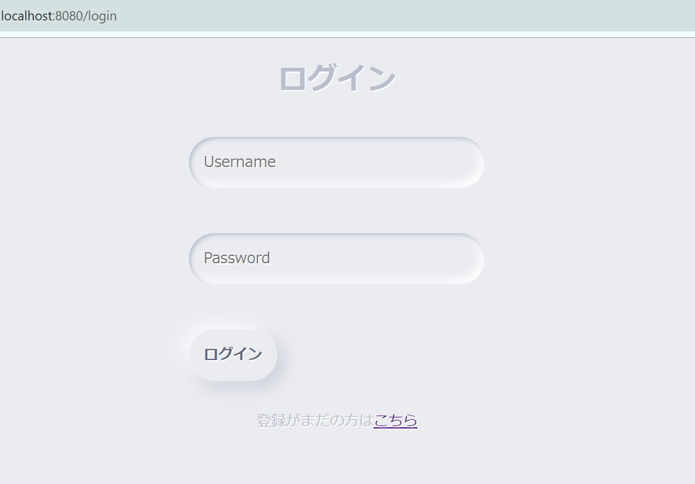
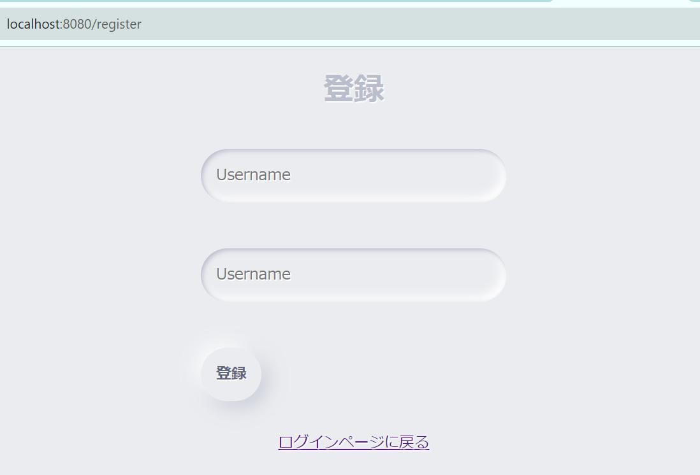

# 家計簿アプリ
## 使用言語
- golang（gin）
- JavaScript（vue.js）
- mysql

## ゴール
- カレンダー画面をホームにした、家計簿アプリを作る
  
## 追加したい機能
  - ログイン機能（個人用だけど、勉強のため）
  - 収入・支出計算機能
  - 固定費を一気に（毎月）追加する機能　など

## TODO
- [ ] カレンダー画面（Home画面　作成）


## 環境構築　注意点
- dockerを使用
- .envファイルをbackendコンテナ内にコピーすること（ビルド時の上位階層のCOPY方法がわからなかった。もっといい方法があれば変更する）
  - wallet-watch-app配下で、```docker cp .env wwa-backend:/go/src/github.com/NananoMasuda/wallet-watch-app/backend/.env```

- ローカル立ち上げ手順
  - ```docker-compose up --build```実行
  - backend, frontend, db　の３つのコンテナが立ち上がる
  - ```docker exec -it wwa-frontend sh```でコンテナ内に入り、```frontend/vue-wallet```配下で```yarn serve```を実行
  - 別ターミナル、```docker exec -it wwa-backend sh```でコンテナ内に入り、```go run main.go```を実行
  - http://localhost:8080/login にアクセスする

## 画面一覧
 - ログイン画面  


 - アカウント登録画面  
